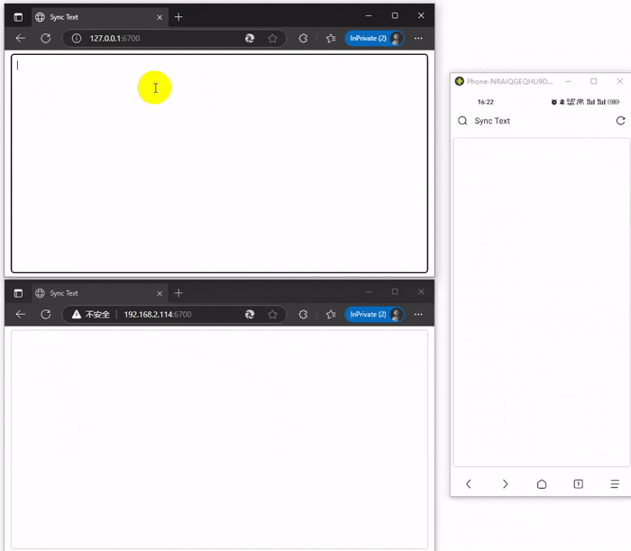

# SyncText
局域网内的设备之间同步文本，使用Rust和WebSocket开发的一个小工具。  

### 使用效果  

### 使用方法
前往 [release](https://github.com/fYoghurt/synctext/releases) 下载 `synctext.exe`， 然后直接运行 `synctext.exe`。  
它会在本地启动Web服务，之后在局域网内打开浏览器访问 `http://ip:6700` （ `ip` 需要替换为启动服务的机器的IP地址），即可看到效果。
